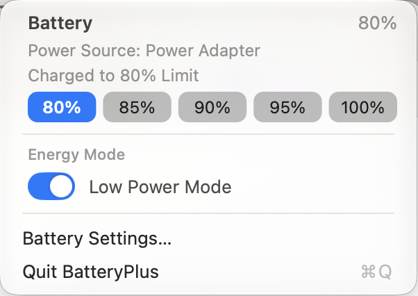

# BatteryPlus — a macOS menu bar battery item

**A drop-in replacement for Apple's battery item that fixes three things it gets wrong: the icon turning
yellow in Low Power Mode, no quick way to set a charge limit, and Low Power Mode dragging your display
brightness down with it.**



Same glyph, same menu as the system's — drawn and calibrated against captures of the real thing — plus the
two controls Apple's own menu doesn't give you, and no colour change when Low Power Mode is on.

## The problems this fixes

| what's wrong with the system item | what BatteryPlus does instead |
|---|---|
| The battery icon turns **yellow** in Low Power Mode, so a glance at the menu bar no longer tells you the charge level | The glyph keeps its normal colour *always*. Low Power Mode is shown inside the menu, where it belongs |
| Setting a **charge limit** means System Settings → Battery → Charging → the **(i)** button → a slider | Five chips right in the menu: **80 / 85 / 90 / 95 / 100 %**. Instant, invisible, no windows opening, no UI automation |
| Turning on **Low Power Mode dims the display**, and the brightness you had is gone | The switch holds your brightness across the change — whichever way the mode was toggled, including from System Settings |
| "Charged to"/"Charging to" wording that doesn't match what the battery is actually doing | The line follows the state: **"Charging to 95% Limit"** below the limit, **"Charged to 80% Limit"** once it's reached |

Setting a limit is what keeps a MacBook that lives plugged in from sitting at 100 % — the usual reason to
want one — and here it's one click, from the same menu you already use to check the battery.

## What you get

* **The native glyph, measured.** 51×28 px while charging and 51×24 px idle, matching the system's item at
  mean ink difference 1.2 % (non-charging) — see `spikes/002-glyph-fidelity/`. It is drawn rather than
  shipped as a template image because a template image is rendered measurably dimmer than Apple's own.
* **Charge limit from the menu**, through the same private client System Settings uses — no permissions,
  no SMC write, no helper, and verified by reading the value back before the menu says it worked.
* **Low Power Mode, on your terms.** The switch sets the policy for both power sources (on is the Battery
  pane's "Always", off is "Never"), so System Settings agrees and unplugging doesn't silently drop it.
* **No brightness jump.** Low Power Mode ramps the display; the app holds your level across it.
* **Native menu, line for line** — matching Apple's own battery menu (`spikes/003-menu-replica/`).
* **No network, no accounts, no telemetry** — see Privacy below.
* **Free and open source** (MIT). Built with `make`; no Homebrew, no third-party dependencies.

## Requirements

* macOS 13 or later (developed and measured on macOS 27, Apple Silicon)
* Xcode Command Line Tools (`swiftc`, `clang`)

## Build, run, install

```sh
make build      # build/BatteryPlus.app
make run        # start it
make install    # copy it to /Applications
make stop       # quit it
make appicon    # regenerate Resources/AppIcon.icns from Sources/IconGenerator
make capture    # pop the menu open and photograph it (development aid)
```

The Low Power switch needs one privileged piece (see **Security**):

```sh
make helper                      # builds the setuid-root tool
sudo install/install-helper.sh   # installs it — one admin prompt, reversible
```

The app adds itself to **Login Items → Open at Login** when it is installed, and never re-adds the item
afterwards — so deleting the row in System Settings → General → Login Items sticks. To finish the swap,
hide Apple's item (System Settings → Control Center → Battery) and ⌘-drag BatteryPlus into its place; the
position is remembered.

`install/make-installer.sh` builds a single `.pkg` (app + tool) locally if you want one. Nothing prebuilt
is published here.

## Security

This repository ships **source only** on purpose: build it yourself, so every privileged piece is one you
compiled and can read.

One piece needs root, because Low Power Mode cannot be set without it — `pmset` refuses as an ordinary user
(`'pmset' must be run as root...`). That piece is a **setuid-root tool**, about 40 lines: fixed program,
fixed flags, empty environment, only for the user at the console. `SECURITY.md` states exactly what it can
and cannot do, and `spikes/007-low-power-daemon/` explains why it is a tool rather than a launchd daemon.

The charge limit uses Apple's private `PowerUISmartChargeClient` in `PowerUI.framework`, the same client
System Settings uses. It is unsupported, may change or disappear with any macOS update, and makes this app
unsuitable for the App Store. Calls are wrapped so a missing API degrades to a reported failure instead of a
crash, and every write is verified by reading it back. Evidence, including how to re-probe the API after an
OS update: `spikes/004-charge-limit/`.

## Privacy

* **No network.** The app makes no network requests — no telemetry, no analytics, no update check, no
  phoning home. `grep` the sources for a URL if you like.
* **No account, no sign-in, nothing to configure.**
* Everything it reads comes from public system APIs, its own menu bar item, and the one local root tool you
  compile yourself.

## Uninstall

```sh
pkill -x BatteryPlus                     # quit it
rm -rf /Applications/BatteryPlus.app     # remove the app
sudo install/uninstall-helper.sh         # remove the privileged tool
```

Remove it from Login Items too if you want. The charge-limit chips and the icon keep working without the
tool — you only lose the Low Power switch.

## How this was built

Everything here is measurement-backed: each investigation under `spikes/` records what was tried, what the
system actually did, and what failed. `STATUS.md` tracks the state of every piece; `PLAN.md` is the working
plan it was built against. Where a number appears in the docs, it came from a capture or a read-back, not
an estimate.

| spike | question it answered |
|---|---|
| `001-energy-mode-api` | what can set the energy mode at all, and how the system reports it back |
| `002-glyph-fidelity` | matching the native glyph's pixels, per column rather than by eye |
| `003-menu-replica` | matching the native battery menu line for line |
| `004-charge-limit` | where the charge limit actually lives (not the SMC) and how to set it directly |
| `005-switch-interaction` | drawing a switch that belongs in a menu, and animating it while the menu is open |
| `006-low-power-brightness` | holding the display brightness across Low Power Mode transitions |
| `007-low-power-daemon` | why the privileged piece became a setuid tool instead of a daemon |
| `008-menu-row-hover` | stale row highlights after a fast cursor sweep, and the exit event that goes missing |

The two most useful findings, in short: the charge-limit setting does not live in the SMC (the `BfSC` key
looks like it but is the *achieved* level), and a menu that is tracking drains neither the default run-loop
mode nor the main queue — which breaks both animations and data updates inside an open menu.

## Known limitations

* The private charge-limit API may break on any macOS update. There is an Accessibility-based fallback, and
  `spikes/004-charge-limit/` shows how to re-probe it.
* The Battery pane in System Settings is a snapshot: it reads Low Power Mode when the pane is created and
  never re-reads, so after a change made from the menu it can display the old option until you reopen it.
  The value itself is correct, and the menu always shows the live state.
* The charging glyph's bolt is an approximation of Apple's silhouette (mean ink difference 8.7 %; the
  non-charging glyph is 1.2 %).
* "Using Significant Energy" is not implemented: the data needs a private entitlement
  (`com.apple.private.systemstats.analysis-client`) that a third-party app cannot obtain.
* Hiding Apple's own battery item is manual, and Login Items registration only applies to an app at
  `/Applications/BatteryPlus.app`.
* Developed and measured on Apple Silicon; the build targets the host architecture, but Intel is untested.

## License

MIT — see `LICENSE`. Not affiliated with Apple, and no Apple assets are redistributed: the artwork is drawn
by this project's own renderer (`Sources/IconGenerator`) from measurements of the menu bar item.
