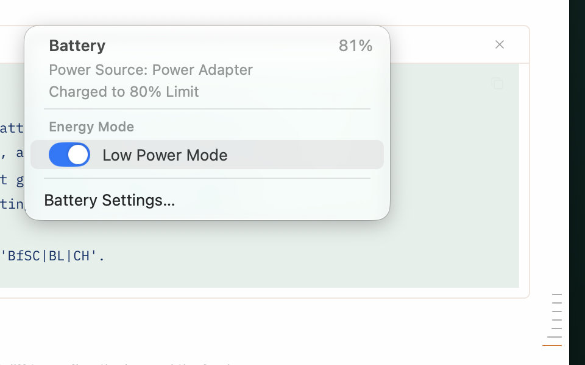

# BatteryPlus

A menu bar battery item for macOS that replaces the system's own: the same drawn glyph — which never
turns yellow in Low Power Mode, unlike Apple's — the same menu, plus a charge limit you can set straight
from the menu and a Low Power switch that doesn't dim your display.



Everything in this repository is measurement-backed. Each investigation under `spikes/` records what was
tried, what the system actually did, and what failed; `STATUS.md` tracks the state of every piece, and
`PLAN.md` is the working plan it was built against. Where a number appears in the docs, it came from a
capture or a read-back, not an estimate.

## What it adds over the system's item

* **The glyph never turns yellow.** Low Power Mode is communicated in the menu instead. The icon is
  drawn rather than shipped as a template image, because a template image is rendered measurably dimmer
  than Apple's own glyph — see `spikes/002-glyph-fidelity/`.
* **Charge limit from the menu** — five chips (80/85/90/95/100 %), set through the same private client
  System Settings uses: instant, invisible, no permissions, no UI automation, no SMC write.
* **Low Power Mode without the brightness dip**, and without the ambiguity. The switch sets the policy
  for both power sources — on is the Battery pane's "Always", off is "Never" — so System Settings agrees
  with the menu and unplugging doesn't silently drop Low Power Mode. Toggling LPM ramps the display
  brightness; the app holds your brightness across the change, including toggles made in Control Center
  or System Settings.
* **Honest wording.** "Charging to 95% Limit" while the battery is below the limit, "Charged to 80%
  Limit" once it has reached it — keyed on the level against the limit, not on `IsCharging`, which lies
  on this hardware.

## Requirements

* macOS 13 or later (developed and measured on macOS 27, Apple Silicon)
* Xcode Command Line Tools (`swiftc`, `clang`) — no Homebrew, no third-party dependencies

## Build, run, install

```sh
make build      # build/BatteryPlus.app
make run        # start it
make install    # copy it to /Applications
make stop       # quit it
make capture    # pop the menu open and photograph it (development aid)
make appicon    # regenerate Resources/AppIcon.icns from Sources/IconGenerator
```

The Low Power switch needs one privileged piece (see **Security** below):

```sh
make helper                      # builds the setuid-root tool
sudo install/install-helper.sh   # installs it — one admin prompt, reversible
```

The app adds itself to **Login Items → Open at Login** when it is installed. It never re-adds the item
afterwards, so deleting the row in System Settings → General → Login Items sticks.

`install/make-installer.sh` builds a single `.pkg` (app + tool) locally, if you want one; nothing
prebuilt is published here.

## Security

This repository ships **source only** on purpose: build it yourself, so every privileged piece is one you
compiled and can read.

One piece needs root, because Low Power Mode cannot be set without it — `pmset` refuses as an ordinary
user (`'pmset' must be run as root...`). That piece is a **setuid-root tool**, about 40 lines: fixed
program, fixed flags, empty environment, only for the user at the console. `SECURITY.md` states exactly
what it can and cannot do, and `spikes/007-low-power-daemon/` explains why it is a tool rather than a
launchd daemon (a launchd job adds a second row to Login Items → Background App Activity, and that row
cannot be given a proper icon without a real Developer ID signature).

The charge limit uses Apple's private `PowerUISmartChargeClient` in `PowerUI.framework` — the same client
System Settings uses. It is unsupported, may change or disappear with any macOS update, and makes this
app unsuitable for the App Store. Calls are wrapped so a missing API degrades to a reported failure
instead of a crash, and every write is verified by reading the value back. Raw evidence, including how to
re-probe the API after an OS update: `spikes/004-charge-limit/`.

## Uninstall

```sh
pkill -x BatteryPlus                     # quit it
rm -rf /Applications/BatteryPlus.app     # remove the app
sudo install/uninstall-helper.sh         # remove the privileged tool
```

Remove it from Login Items too if you want. The charge-limit chips and the icon keep working without the
tool — you only lose the Low Power switch.

## How this was built

| spike | question it answered |
|---|---|
| `001-energy-mode-api` | what can set the energy mode at all, and how does the system report it back |
| `002-glyph-fidelity` | matching the native glyph's pixels, per column rather than by eye |
| `003-menu-replica` | matching the native battery menu line for line |
| `004-charge-limit` | where the charge limit actually lives (not the SMC) and how to set it directly |
| `005-switch-interaction` | drawing a switch that belongs in a menu, and animating it while the menu is open |
| `006-low-power-brightness` | holding the display brightness across Low Power Mode transitions |
| `007-low-power-daemon` | why the privileged piece became a setuid tool instead of a daemon |
| `008-menu-row-hover` | stale row highlights after a fast cursor sweep, and the exit event that goes missing |

The short version of the two most useful findings: the charge-limit setting does not live in the SMC (the
`BfSC` key looks like it but is the *achieved* level), and a menu that is tracking drains neither the
default run-loop mode nor the main queue — which breaks both animations and data updates inside an open
menu.

## Known limitations

* The private charge-limit API may break on any macOS update. There is an Accessibility-based fallback,
  and `spikes/004-charge-limit/` shows how to re-probe it.
* The charging glyph's bolt is an approximation of Apple's silhouette (mean ink difference 8.7 %; the
  non-charging glyph is 1.2 %). A bounding box cannot tell a rounded tip from a rectangle — see the
  spike for what that taught.
* "Using Significant Energy" is not implemented: the data needs a private entitlement
  (`com.apple.private.systemstats.analysis-client`) that a third-party app cannot obtain.
* Hiding Apple's own battery item is manual (System Settings → Control Center → Battery).
* Login Items registration only ever applies to an app at `/Applications/BatteryPlus.app`.
* Developed and measured on Apple Silicon; the build targets the host architecture, but Intel is untested.

## License

MIT — see `LICENSE`. Not affiliated with Apple; the artwork is drawn by this project's own renderer
(`Sources/IconGenerator`) from measurements of the menu bar item, and no Apple assets are redistributed.
